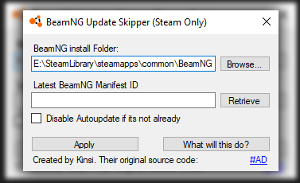

# BeamNG UpdateSkipper
Simple tool to prevent Steam from Updating BeamNG.drive (Windows+Steam) whenever there happens to be an update so you dont need to copy around files and end up possibly wrecking your setup.

  

# How to use

1. DISABLE AUTO UPDATING OF BEAMNG.DRIVE IN STEAM BEFORE THERE IS AN UPDATE!

2. Download the latest version of the application from [the releases](https://github.com/BeamNG-Tools/BeamNG_UpdateSkipper/releases)

3. Rest should be pretty much self explanatory. Whenever Steam wants you to update BeamNG, you can make use of this to prevent it from actually updating.

# And how do I actually update the game after using this?

Since Steam thinks you are on the latest version, eventho you are not, obviously your files differ from the ones that should exist for this version, so to actually do the update once mods are ready simply to go the properties of BeamNG.Drive in Steam and verify the integrity of the game files.

# Original Source/Repo:
[Kinsi55's BeatSaber UpdateSkipper](https://github.com/kinsi55/BeatSaber_UpdateSkipper)
